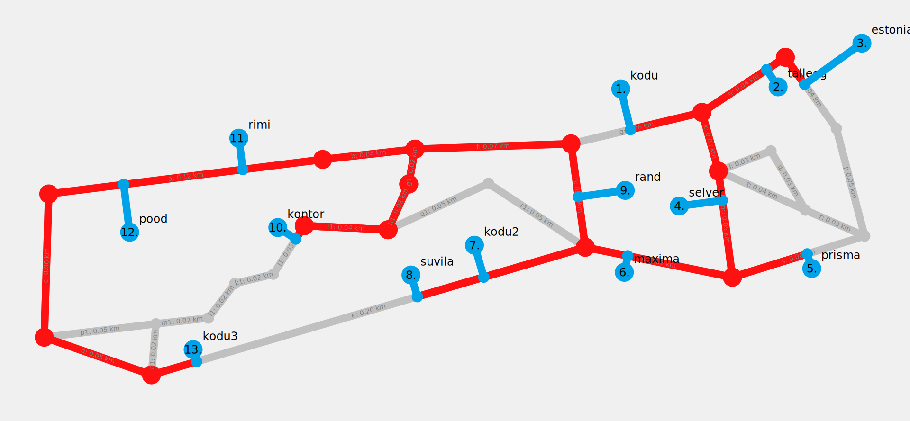

# Proovireisija

> Tarkvara projekt, mille eesmärk on ära lahendada proovireisija ülesanne.

# Praegune plaan

Esialgu prooviks ülesande ära lahendada graafiteoreetiliselt, programmile antakse ristmike xy-koordinaadid
(ristmikel on identifikaatorid) ning info millised ristmikud on omavahel ühendatud. Esialgu katsetaks
väikeste proovifailidega. Samuti antakse programmile kuni 10 xy-koordinaati, kus on vaja peatuda, algus- ja lõpp-punkt jäävad alati paika.
Programm leiaks, millised teed on lähimad antud punktidele, teedele lisatakse peatused uute vahepunktidena/graafi tippudena.
Programm leiaks kasutades [Dijkstra algoritmi](https://en.wikipedia.org/wiki/Dijkstra%27s_algorithm) lühimad kaugused soovitud punktide kõikvõimalike kombinatsioonide vahel.
Nendest lühimatest kaugustest tekib N*N maatriks (N sihtpunkti). Seal saab hakata järjest läbi proovima, millises järjekorras punkte läbides
tekiks optimaalne teekond.

# Projekti edenemine

Projekti ajalogi on saadaval [siin](./ajalogi.txt).

- [x] Andmete lugemine failist
- [x] Punktide lisamine vahepunktidena lähimatele teedele
- [x] Dijkstra algoritmi implementatsioon
- [x] Optimaalse teekonna leidmine
- [x] Teedele anda "kaalud"/"hinnad"
- [x] Lihtne kasutajaliides teekonna kuvamiseks

Näidisväljundid:

- [x] Koodi dokumenteerimine
- [x] Koodi korrastamine
- [ ] Aruande koostamine

# Materjalid

- [*INI file* wiki](https://en.wikipedia.org/wiki/INI_file) -> INI faili formaat
- [*Unicode block* wiki](https://en.wikipedia.org/wiki/Unicode_block)
- [*Specials (Unicode block)* wiki](https://en.wikipedia.org/wiki/Specials_(Unicode_block)) -> Sealt pärineb koodis kokkuleppeline "keelatud" Unicode märgend *hex* väärtusega 0xFFFF
- [*C reference*](https://en.cppreference.com/w/c) -> Alati abiks C standardteegi mõistmisel
- [*UTF-8* wiki](https://en.wikipedia.org/wiki/UTF-8#Encoding) -> Abiks Unicode *code pointide* UTF-8'ks konverteerimisel
- [*Dijkstra's algorithm* wiki](https://en.wikipedia.org/wiki/Dijkstra%27s_algorithm) -> Abiks lühima tee leidmisel kahe punkti vahel
- [*Dijkstra's algorithm - Computerphile* video](https://www.youtube.com/watch?v=GazC3A4OQTE) -> Abiks Dijkstra algoritmi mõistmisel
- [*Fibonacci heap* wiki](https://en.wikipedia.org/wiki/Fibonacci_heap) -> Abiks eelisjärjekorra andmestruktuuri implementeerimisel
- [*Fibonacci heap*](https://www.programiz.com/dsa/fibonacci-heap) -> Abiks Fibonacci kuhja andmestruktuuri implementeerimisel
- [*FibonacciHeap* repositoorium](https://github.com/woodfrog/FibonacciHeap) -> Abiks Fibonacci kuhja algoritmilise osa implementeerimisel

